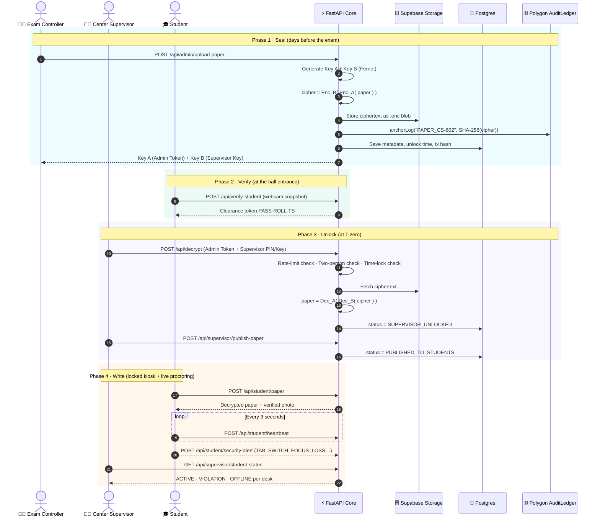
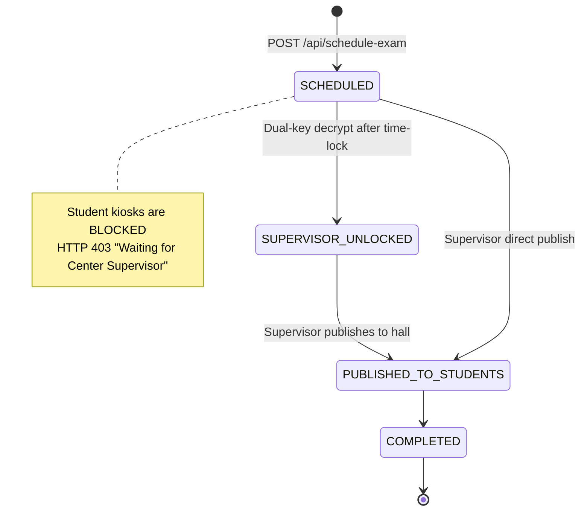
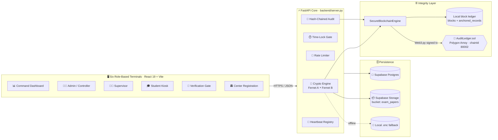
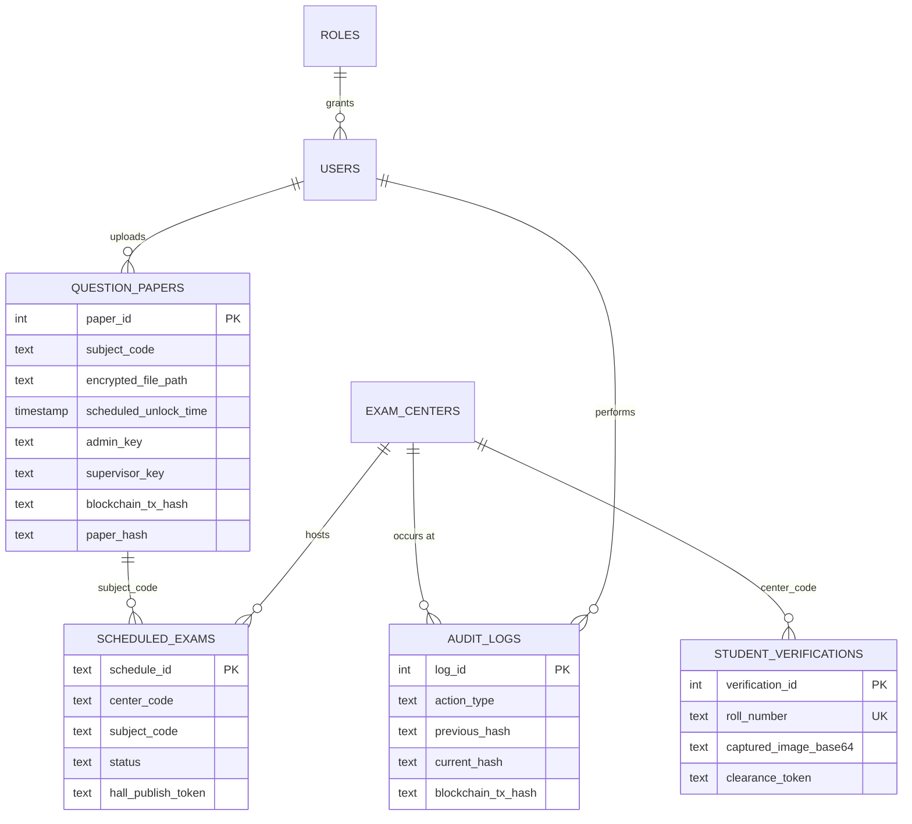

<div align="center">


<h1>🛡️ Secure EMS</h1>

<h3>The open-source, zero-trust platform that makes exam paper leaks <i>cryptographically impossible</i> before the bell rings.</h3>

<p>
Two-stage split-key encryption · Server-enforced time-locks · Blockchain-anchored audit trail · Locked-down student kiosks · Live proctoring
</p>

<p>
  <a href="https://github.com/vshreyansh7-crypto/Secure-EMS/actions/workflows/ci.yml"></a>
  <a href="https://github.com/vshreyansh7-crypto/Secure-EMS/stargazers"></a>
  <a href="https://github.com/vshreyansh7-crypto/Secure-EMS/network/members"></a>
  <a href="https://github.com/vshreyansh7-crypto/Secure-EMS/issues"></a>
  <a href="https://github.com/vshreyansh7-crypto/Secure-EMS/commits/main"></a>
  
</p>

<p>
  
  
  
  
  
  
  
  
</p>

<p>
  <a href="#-quick-start"><b>🚀 Quick Start</b></a> ·
  <a href="#-how-it-works"><b>⚙️ How It Works</b></a> ·
  <a href="#-the-seven-layers-of-defense"><b>🔐 Security Layers</b></a> ·
  <a href="#-rest-api-reference"><b>📡 API</b></a> ·
  <a href="#%EF%B8%8F-security-model--honest-limitations"><b>⚖️ Threat Model</b></a> ·
  <a href="#%EF%B8%8F-roadmap"><b>🗺️ Roadmap</b></a>
</p>

</div>

---

## 💥 The Problem

Every year, national and university examinations are **cancelled, postponed, or compromised** because a question paper leaks hours, sometimes days, before the exam. The weak link is always the same: **somewhere, someone holds a readable copy of the paper too early.** Printing presses, couriers, strong-rooms, email attachments, a single corrupt official. Millions of students pay the price.

## ✨ The Solution

**Secure EMS removes the "someone".**

A question paper in Secure EMS is never readable by any single person, on any single machine, before its scheduled time:

> 🔑 It is **double-encrypted** with two independent keys held by two different authorities.
> ⏱️ The server **refuses to decrypt** it before a scheduled time-lock, even with both keys.
> ⛓️ Its fingerprint is **anchored on a public blockchain**, so any byte-level tampering is detectable by anyone.
> 📝 Every action, successful or not, is written to a **SHA-256 hash-chained audit ledger**.
> 🖥️ Students read it on a **locked-down kiosk** that reports every tab-switch, right-click, and shortcut to a live supervisor console.

<div align="center">

| 🧮 **~8,600** lines of code | 📡 **22** REST endpoints | 🖥️ **6** role-based terminals | 🧪 **32** automated tests | ⛓️ **1** on-chain smart contract |
| :---: | :---: | :---: | :---: | :---: |

</div>

---

## 📚 Table of Contents

<details open>
<summary><b>Click to expand / collapse</b></summary>

- [💥 The Problem](#-the-problem)
- [✨ The Solution](#-the-solution)
- [⚙️ How It Works](#-how-it-works)
  - [The Exam Lifecycle](#the-exam-lifecycle-end-to-end)
  - [Exam State Machine](#exam-state-machine)
- [🔐 The Seven Layers of Defense](#-the-seven-layers-of-defense)
- [🏛️ System Architecture](#%EF%B8%8F-system-architecture)
- [🖥️ The Six Terminals](#%EF%B8%8F-the-six-terminals)
- [⛓️ Blockchain Integrity Layer](#%EF%B8%8F-blockchain-integrity-layer)
- [📝 The Hash-Chained Audit Ledger](#-the-hash-chained-audit-ledger)
- [🧰 Technology Stack](#-technology-stack)
- [📂 Project Structure](#-project-structure)
- [🚀 Quick Start](#-quick-start)
- [🔧 Configuration](#-configuration)
- [🗄️ Database Schema](#%EF%B8%8F-database-schema)
- [📡 REST API Reference](#-rest-api-reference)
- [🧪 Testing & CI](#-testing--ci)
- [☁️ Deployment](#%EF%B8%8F-deployment)
- [⚖️ Security Model & Honest Limitations](#%EF%B8%8F-security-model--honest-limitations)
- [🗺️ Roadmap](#%EF%B8%8F-roadmap)
- [🤝 Contributing](#-contributing)
- [⭐ Star History](#-star-history)

</details>

---

## ⚙️ How It Works

### The Exam Lifecycle, End to End



> Every arrow above that touches the API is also written to the audit ledger, and audit entries are themselves anchored on-chain.

### Exam State Machine



---

## 🔐 The Seven Layers of Defense

An attacker has to defeat **every** layer, not just one.

| # | Layer | What it stops | How it's implemented |
|:-:|:---|:---|:---|
| 1 | **🔐 Two-Stage Nested Encryption** | A stolen file being readable | The paper is encrypted with **Key A** (Admin), then that ciphertext is encrypted again with **Key B** (Supervisor), using `cryptography.Fernet` (AES-128-CBC + HMAC-SHA256). See [`upload_question_paper`](backend/server.py). |
| 2 | **🔑 Split-Key Two-Person Rule** | A single rogue official | `/api/decrypt` hard-rejects any request missing the **Admin Token (Key A)** *and* a valid **Supervisor PIN / Key B**. Neither authority can unlock alone. |
| 3 | **⏱️ Server-Side Time-Lock** | Early opening, even with both keys | The server compares its own clock against `scheduled_unlock_time`. Early attempts return `403` and log `TIME_LOCK_SECURITY_BLOCK`. Client clocks are never trusted. |
| 4 | **🛑 Adaptive Brute-Force Shield** | PIN guessing | [`SecurityRateLimiter`](backend/server.py) tracks failures per `center_code + IP`. **5 failures → 15-minute lockout.** |
| 5 | **⛓️ Blockchain Anchoring** | Silent file substitution or tampering | SHA-256 of every ciphertext and every audit entry is anchored to the [`AuditLedger`](backend/contracts/AuditLedger.sol) smart contract on **Polygon Amoy**. `/api/blockchain/verify-paper` re-hashes the stored file and checks it against the chain. |
| 6 | **📝 Hash-Chained Audit Ledger** | Covering your tracks | Each log row stores `previous_hash` and `current_hash = SHA-256(prev ‖ ts ‖ user ‖ center ‖ action ‖ details ‖ ip)`. Edit one row and the chain breaks. |
| 7 | **🖥️ Kiosk Lockdown + Live Proctoring** | In-hall cheating | The student terminal forces fullscreen and blocks right-click, copy/cut/paste, `Ctrl`/`Alt`/`Meta` combos, `F12`, `PrintScreen`, and `Esc`. Tab-switches and window blur are reported instantly, and heartbeats every **3 s** drive a live `ACTIVE / VIOLATION / OFFLINE` grid. |

**Bonus controls:** webcam-based candidate verification with clearance tokens, venue accreditation certificates, forensic watermarking on print dispatch (`CTR-101 | timestamp | IP`), and a challenge-nonce endpoint for terminal handshakes.

---

## 🏛️ System Architecture



**Graceful degradation is built in at every layer:**

| If this is missing… | …Secure EMS falls back to |
|:---|:---|
| Supabase Storage credentials | Local `.enc` files on disk |
| Polygon RPC / private key / contract address | A **local SHA-256 block ledger** with a genesis block, so the API keeps the same shape |
| Real-chain tx fails mid-flight | Deterministic local tx hash, so the request still succeeds |
| FastAPI / Uvicorn not installed | A **zero-dependency `http.server`** on port `5050` that serves the same routes |
| Local ledger DB wiped | `sync_from_global_chain()` rebuilds it from on-chain `LogAnchored` events |

---

## 🖥️ The Six Terminals

One React bundle serves six distinct portals. [`App.jsx`](frontend/src/App.jsx) picks the terminal from the **subdomain**, **path**, **`?portal=` query**, **hash**, or the `VITE_DEFAULT_PORTAL` env var, so each role can be deployed to its own hostname.

| Terminal | Route / Trigger | Who uses it | Highlights |
|:---|:---|:---|:---|
| 📊 [**ExamDashboard**](frontend/src/ExamDashboard.jsx) | `/` (default) | Command center | Live metrics, countdowns, audit stream, personnel monitor, exam scheduler, blockchain ledger viewer |
| 👨‍💼 [**AdminTerminal**](frontend/src/AdminTerminal.jsx) | `/admin` · `admin.*` · `?portal=admin` | Exam Controller | Text, PDF, or **page-wise image** upload → double encryption → split keys issued → time-lock set |
| 🧑‍🏫 [**SupervisorTerminal**](frontend/src/SupervisorTerminal.jsx) | `/supervisor` · `supervisor.*` | Center Supervisor | Time-lock countdown, dual-key decryption, publish to hall, watermarked print dispatch, live kiosk grid |
| 🎓 [**StudentTerminal**](frontend/src/StudentTerminal.jsx) | `/student` · `student.*` | Candidate | Fullscreen locked kiosk, PDF canvas and image viewers, verified photo badge, 3 s heartbeat, violation reporting |
| 📸 [**VerificationTerminal**](frontend/src/VerificationTerminal.jsx) | `/verify` · `verify.*` | Gate staff | `getUserMedia` webcam capture, candidate verification, clearance token issuance |
| 🏛️ [**CenterRegistrationTerminal**](frontend/src/CenterRegistrationTerminal.jsx) | `/register` · `register.*` | Venue admins | Venue onboarding and digital accreditation certificate (`CERT-CODE-TS`) |

> 💡 **Pro tip:** Deploy the same build to `admin.yourdomain.com`, `supervisor.yourdomain.com`, `student.yourdomain.com` and so on. Each hostname boots straight into its terminal with no extra routing config.

---

## ⛓️ Blockchain Integrity Layer

The on-chain contract is deliberately tiny, and that makes it easy to audit.

```solidity
// backend/contracts/AuditLedger.sol
function anchorLog(string memory logId, bytes32 payloadHash) external {
    require(!_ledger[logId].exists, "AuditLedger: Record already anchored"); // write-once
    _ledger[logId] = LogRecord(payloadHash, block.timestamp, msg.sender, true);
    emit LogAnchored(logId, payloadHash, block.timestamp, msg.sender);
}

function verifyLog(string memory logId, bytes32 payloadHash)
    external view returns (bool isMatch, uint256 timestamp, address anchorer);
```

**Key properties**

- **Write-once records:** a paper's fingerprint can never be overwritten, not even by the deployer.
- **Public verifiability:** anyone with the tx hash can check it on [Amoy PolygonScan](https://amoy.polygonscan.com/).
- **Record IDs:** papers are anchored as `PAPER_<SUBJECT>`, audit entries as `LOG_<timestamp>_<ACTION>`.
- **Dual verification:** [`verify_record`](backend/secure_blockchain_engine.py) checks the local ledger *and* calls `verifyLog` on-chain. Both must agree.
- **Disaster recovery:** `sync_from_global_chain()` replays `LogAnchored` events and decodes the original tx input to rebuild a wiped local ledger.

---

## 📝 The Hash-Chained Audit Ledger

Every security-relevant event is chained to the one before it:

```text
current_hash = SHA-256( previous_hash | ISO-timestamp | user_id | center_id | action_type | details | ip_address )
genesis previous_hash = 0000000000000000000000000000000000000000000000000000000000000000
```

`GET /api/audit-logs/verify-integrity` walks the whole chain and reports:

```json
{
  "status": "VERIFIED",
  "audit_chain_valid": true,
  "total_blocks_checked": 412,
  "tampered_log_ids": [],
  "latest_head_hash": "9f2c…e71a",
  "message": "Cryptographic audit ledger hash chain verified intact. Zero tampering detected."
}
```

<details>
<summary><b>📋 Event types you'll see in the ledger</b></summary>

| Category | Action types |
|:---|:---|
| Paper lifecycle | `PAPER_UPLOAD_AND_ENCRYPT_SUCCESS`, `DUAL_KEY_DECRYPTION_SUCCESS`, `DECRYPTION_FAILED`, `PAPER_PUBLISHED_TO_STUDENT_KIOSKS` |
| Attacks blocked | `SPLIT_KEY_MISSING_TOKEN`, `INVALID_PIN_ATTEMPT`, `TIME_LOCK_SECURITY_BLOCK`, `STUDENT_TIME_LOCK_SECURITY_BLOCK`, `AUTH_FAILED` |
| Student kiosk | `STUDENT_KIOSK_SESSION_START`, `STUDENT_WAITING_FOR_SUPERVISOR`, `SECURITY_ALERT_TAB_SWITCH`, `SECURITY_ALERT_FOCUS_LOSS`, `SECURITY_ALERT_RIGHT_CLICK_ATTEMPT`, `SECURITY_ALERT_CLIPBOARD_TAMPER_ATTEMPT`, `SECURITY_ALERT_RESTRICTED_KEY_PRESS` |
| Operations | `EXAM_CENTER_REGISTERED`, `EXAM_SCHEDULED_BY_AI_AGENT`, `STUDENT_PRE_EXAM_VERIFICATION`, `PRINT_DISPATCH_<N>_COPIES`, `ZKP_CHALLENGE_ISSUED` |

</details>

---

## 🧰 Technology Stack

<table>
<tr>
<td valign="top" width="33%">

**🎨 Frontend**
- React 19 (class + function components)
- Vite 8 with `/api` dev proxy
- PDF.js canvas renderer
- Vanilla CSS glassmorphism theme
- Electron 29 + electron-builder (NSIS)

</td>
<td valign="top" width="33%">

**⚡ Backend**
- FastAPI + Uvicorn
- Pydantic request models
- `cryptography` (Fernet)
- psycopg2 → Supabase Postgres
- Supabase Storage SDK
- PyInstaller single-binary build

</td>
<td valign="top" width="33%">

**⛓️ Integrity & Ops**
- Solidity 0.8.20
- Web3.py + py-solc-x
- Polygon Amoy testnet
- Pytest + Vitest + Testing Library
- Oxlint (Rust linter)
- GitHub Actions · Vercel · Render

</td>
</tr>
</table>

---

## 📂 Project Structure

```text
Secure-EMS/
├── 📁 backend/
│   ├── server.py                    # ⚡ FastAPI app: 22 endpoints, crypto, time-lock, rate-limit, audit
│   ├── secure_blockchain_engine.py  # ⛓️ Local block ledger + Polygon Web3 anchoring & verification
│   ├── cloud_db_driver.py           # 🐘 SQLite-compatible adapter over Supabase Postgres
│   ├── cloud_storage_driver.py      # 📦 Supabase Storage with local-disk fallback
│   ├── database_setup.py            # 🗄️ Schema bootstrap (SQLite / desktop mode)
│   ├── insert_sample_data.py        # 🌱 Seeds roles, users, CTR-101 and a sample CS-602 paper
│   ├── add_admin.py                 # 👤 CLI: create/update privileged users
│   ├── deploy_contract.py           # 🚀 Compile + deploy AuditLedger.sol, auto-writes CONTRACT_ADDRESS
│   ├── build_backend.py             # 📦 PyInstaller → dist-backend/server.exe
│   ├── db_config.py                 # 📍 OS-aware app-data paths (APPDATA / Library / .local)
│   ├── contracts/AuditLedger.sol    # 📜 Write-once on-chain anchor ledger
│   ├── api/index.py                 # ▲ Serverless entrypoint
│   └── tests/                       # 🧪 17 pytest cases
├── 📁 frontend/
│   ├── src/
│   │   ├── App.jsx                  # 🧭 Host/path/query-based portal router
│   │   ├── ExamDashboard.jsx        # 📊 Command center
│   │   ├── AdminTerminal.jsx        # 👨‍💼 Upload & key issuance
│   │   ├── SupervisorTerminal.jsx   # 🧑‍🏫 Dual-key unlock & proctoring
│   │   ├── StudentTerminal.jsx      # 🎓 Locked kiosk
│   │   ├── VerificationTerminal.jsx # 📸 Webcam gate
│   │   ├── CenterRegistrationTerminal.jsx
│   │   ├── PdfCanvasViewer.jsx      # 📄 PDF.js renderer
│   │   └── ImagePaperViewer.jsx     # 🖼️ Page-wise image papers
│   ├── tests/                       # 🧪 15 Vitest cases
│   └── vite.config.js
├── db_connector.py                  # 🔌 SQLite-API shim over Postgres (ledger DB)
├── .github/workflows/ci.yml         # 🤖 Backend + frontend CI
├── vercel.json                      # ▲ Frontend deploy config
└── package.json                     # 🧩 Monorepo convenience scripts
```

---

## 🚀 Quick Start

### Prerequisites

| Tool | Version |
|:---|:---|
| 🐍 Python | 3.10+ (CI uses 3.12) |
| 🟢 Node.js | 18+ (CI uses 20) |
| 🐘 Postgres | A free [Supabase](https://supabase.com) project works well |
| 🦊 *(optional)* MetaMask wallet | With Amoy test POL from the [Polygon faucet](https://faucet.polygon.technology/) |

### 1️⃣ Clone

```bash
git clone https://github.com/vshreyansh7-crypto/Secure-EMS.git
cd Secure-EMS
```

### 2️⃣ Configure secrets

```bash
cp .env.example .env        # Windows PowerShell: Copy-Item .env.example .env
```

Fill in the values described in [🔧 Configuration](#-configuration), then create the tables using the SQL in [🗄️ Database Schema](#%EF%B8%8F-database-schema).

### 3️⃣ Backend

<table>
<tr><th>pip</th><th>uv (faster)</th></tr>
<tr>
<td>

```bash
cd backend
python -m venv .venv
# macOS/Linux: source .venv/bin/activate
# Windows:     .venv\Scripts\activate
pip install -r requirements.txt
```

</td>
<td>

```bash
cd backend
uv venv
uv pip install -r requirements.txt
```

</td>
</tr>
</table>

```bash
# The ledger engine imports db_connector.py from the repo root
# macOS/Linux
PYTHONPATH=.. python server.py
# Windows PowerShell
$env:PYTHONPATH=".."; python server.py
```

✅ API is live at **http://localhost:8000**, and interactive Swagger docs are at **http://localhost:8000/docs**.

### 4️⃣ Frontend

```bash
cd frontend
npm install
npm run dev
```

✅ Open **http://localhost:5173**. Try `/admin`, `/supervisor`, `/student`, `/verify`, and `/register`.

> [!IMPORTANT]
> The terminals currently point at the hosted API through a hard-coded `API_BASE` constant at the top of each `frontend/src/*Terminal.jsx` / `ExamDashboard.jsx`. For a fully local setup, set it to `''` so requests go through Vite's `/api` → `localhost:8000` proxy.

### 5️⃣ *(Optional)* Go on-chain

```bash
cd backend
pip install py-solc-x
python deploy_contract.py   # compiles, deploys, and writes CONTRACT_ADDRESS into .env
```

Restart the server and look for `Web3 Connected to Polygon Amoy Testnet`. Every upload now returns a real `explorer_url`.

### 🎬 60-second demo script

1. **Admin** (`/admin`): upload a paper for `CS-602` with a 30-second delay. Copy both keys.
2. **Supervisor** (`/supervisor`): try to decrypt immediately → **blocked by time-lock** 🔒.
3. Enter a wrong PIN 5 times → **locked out for 15 minutes** 🛑.
4. Wait for the window, then decrypt with **Admin Token + Supervisor Key** → paper revealed ✅. Click **Publish**.
5. **Verify** (`/verify`): capture a candidate photo for roll `2026-CS-101`.
6. **Student** (`/student`): log in, then try `Alt+Tab` → watch the supervisor grid turn **VIOLATION** 🚨.
7. **Dashboard** (`/`): run **Verify Integrity** on the audit chain and **Verify on Chain** for the paper.

---

## 🔧 Configuration

All backend secrets live in a single root `.env`.

| Variable | Required | Used by | Purpose |
|:---|:---:|:---|:---|
| `SUPABASE_DATABASE_URL` | ✅ | `cloud_db_driver.py` | Postgres DSN for the application tables |
| `DATABASE_URL` | ✅ | `db_connector.py` | Postgres DSN for the blockchain ledger tables (can be the same DB) |
| `SUPABASE_URL` | ⚪ | `cloud_storage_driver.py` | Supabase project URL for the `exam_papers` bucket |
| `SUPABASE_KEY` | ⚪ | `cloud_storage_driver.py` | Supabase service key (falls back to local disk if absent) |
| `POLYGON_RPC_URL` | ⚪ | blockchain engine | Defaults to `https://rpc-amoy.polygon.technology` |
| `PRIVATE_KEY` | ⚪ | blockchain engine | Wallet that signs anchor transactions. **Use a dedicated testnet wallet.** |
| `CONTRACT_ADDRESS` | ⚪ | blockchain engine | Deployed `AuditLedger` address (auto-filled by `deploy_contract.py`) |
| `VITE_DEFAULT_PORTAL` | ⚪ | `frontend` | Force a terminal: `admin` · `supervisor` · `student` · `verify` · `register` |

> [!CAUTION]
> **Never commit `.env`.** Make sure `.env` is listed in `.gitignore`, and keep `.env.example` limited to placeholders. A leaked `PRIVATE_KEY` is a drained wallet.

---

## 🗄️ Database Schema



<details>
<summary><b>🐘 Postgres bootstrap SQL (paste into the Supabase SQL editor)</b></summary>

> The Postgres adapter intentionally skips `CREATE TABLE` / `ALTER TABLE` at runtime, so create the schema once up front.

```sql
CREATE TABLE IF NOT EXISTS roles (
    role_id      SERIAL PRIMARY KEY,
    role_name    TEXT UNIQUE NOT NULL,
    description  TEXT
);

CREATE TABLE IF NOT EXISTS users (
    user_id       SERIAL PRIMARY KEY,
    username      TEXT UNIQUE NOT NULL,
    password_hash TEXT NOT NULL,
    role_id       INTEGER REFERENCES roles(role_id),
    is_active     BOOLEAN DEFAULT TRUE,
    created_at    TIMESTAMP DEFAULT CURRENT_TIMESTAMP
);

CREATE TABLE IF NOT EXISTS exam_centers (
    center_id             SERIAL PRIMARY KEY,
    center_code           TEXT UNIQUE NOT NULL,
    center_name           TEXT NOT NULL,
    location              TEXT,
    address               TEXT,
    contact_number        TEXT,
    email                 TEXT,
    authorized_device_mac TEXT,
    is_locked_down        BOOLEAN DEFAULT TRUE,
    pin_hash              TEXT,
    status                TEXT DEFAULT 'ACCREDITED',
    created_at            TIMESTAMP DEFAULT CURRENT_TIMESTAMP
);

CREATE TABLE IF NOT EXISTS question_papers (
    paper_id              SERIAL PRIMARY KEY,
    subject_code          TEXT NOT NULL,
    encrypted_file_path   TEXT NOT NULL,
    scheduled_unlock_time TIMESTAMP NOT NULL,
    encryption_key        TEXT,
    admin_key             TEXT,
    supervisor_key        TEXT,
    uploaded_by           INTEGER REFERENCES users(user_id),
    blockchain_tx_hash    TEXT,
    paper_hash            TEXT,
    on_chain_status       TEXT,
    created_at            TIMESTAMP DEFAULT CURRENT_TIMESTAMP
);

CREATE TABLE IF NOT EXISTS audit_logs (
    log_id             SERIAL PRIMARY KEY,
    user_id            INTEGER,
    center_id          INTEGER,
    action_type        TEXT NOT NULL,
    details            TEXT,
    ip_address         TEXT,
    previous_hash      TEXT,
    current_hash       TEXT,
    blockchain_tx_hash TEXT,
    on_chain_status    TEXT,
    timestamp          TIMESTAMP DEFAULT CURRENT_TIMESTAMP
);

CREATE TABLE IF NOT EXISTS student_verifications (
    verification_id         SERIAL PRIMARY KEY,
    roll_number             TEXT UNIQUE NOT NULL,
    seat_id                 TEXT,
    center_code             TEXT,
    captured_image_base64   TEXT,
    clearance_token         TEXT,
    facial_match_confidence REAL,
    status                  TEXT DEFAULT 'VERIFIED',
    timestamp               TIMESTAMP DEFAULT CURRENT_TIMESTAMP
);

CREATE TABLE IF NOT EXISTS scheduled_exams (
    schedule_id            TEXT PRIMARY KEY,
    center_code            TEXT NOT NULL,
    exam_date              TEXT NOT NULL,
    exam_time              TEXT DEFAULT '10:00 AM',
    subject_code           TEXT NOT NULL,
    duration_mins          INTEGER DEFAULT 180,
    scheduled_by           TEXT DEFAULT 'AI_AGENT_SCHEDULER',
    status                 TEXT DEFAULT 'SCHEDULED',
    supervisor_unlocked_at TIMESTAMP,
    unlocked_by_user       TEXT,
    hall_publish_token     TEXT,
    created_at             TIMESTAMP DEFAULT CURRENT_TIMESTAMP
);

INSERT INTO roles (role_name, description) VALUES
    ('ADMIN',      'System Administrator with full management privileges'),
    ('CONTROLLER', 'Examination Controller responsible for paper upload and scheduling'),
    ('SUPERVISOR', 'Center Supervisor responsible for unlocking and printing at exam venues')
ON CONFLICT (role_name) DO NOTHING;
```

The blockchain ledger tables (`blocks`, `anchored_records`) are created automatically by `SecureBlockchainEngine` on first boot, along with a deterministic genesis block.

</details>

---

## 📡 REST API Reference

Full interactive docs are auto-generated at **`/docs`** (Swagger UI) and **`/redoc`**.

<details open>
<summary><b>🔐 Papers & Cryptography</b></summary>

| Method | Endpoint | Description |
|:---:|:---|:---|
| `POST` | `/api/admin/upload-paper` | Double-encrypt a paper, issue Key A + Key B, set the time-lock, and anchor on-chain |
| `GET` | `/api/admin/papers` | List registered papers with keys, unlock time, and tx hash |
| `POST` | `/api/decrypt` | **Two-person, time-locked, rate-limited** dual-key decryption |
| `POST` | `/api/print` | Dispatch watermarked print copies (audited) |
| `POST` | `/api/auth/challenge` | Issue a random nonce challenge for terminal handshakes |

</details>

<details>
<summary><b>⛓️ Blockchain & Audit</b></summary>

| Method | Endpoint | Description |
|:---:|:---|:---|
| `POST` | `/api/blockchain/verify-paper` | Re-hash the stored ciphertext and verify it against the local ledger and the on-chain record |
| `GET` | `/api/blockchain/ledger` | Latest 25 anchored blocks |
| `GET` | `/api/audit-logs` | Latest 50 audit entries |
| `GET` | `/api/audit-logs/verify-integrity` | Walk the full SHA-256 hash chain and report tampered IDs |

</details>

<details>
<summary><b>🎓 Students & Proctoring</b></summary>

| Method | Endpoint | Description |
|:---:|:---|:---|
| `POST` | `/api/verify-student` | Store the webcam snapshot and issue clearance token `PASS-ROLL-TS` |
| `GET` | `/api/student/verification/{roll_number}` | Fetch a candidate's verification record and photo |
| `POST` | `/api/student/paper` | Kiosk paper fetch (time-lock + supervisor-publish gated) |
| `POST` | `/api/student/heartbeat` | 3-second liveness ping with violation count |
| `POST` | `/api/student/security-alert` | Report `TAB_SWITCH`, `FOCUS_LOSS`, `RIGHT_CLICK_ATTEMPT`, … |
| `GET` | `/api/supervisor/student-status` | Live `ACTIVE` / `VIOLATION` / `OFFLINE` grid (offline after 10 s silence) |

</details>

<details>
<summary><b>🏛️ Centers, Scheduling & Dashboard</b></summary>

| Method | Endpoint | Description |
|:---:|:---|:---|
| `POST` | `/api/register-center` | Accredit a venue and issue `CERT-CODE-TS` |
| `GET` | `/api/registered-centers` | List accredited venues |
| `POST` | `/api/schedule-exam` | Schedule a subject at a center |
| `GET` | `/api/scheduled-exams` | All schedules |
| `GET` | `/api/supervisor/scheduled-exams?center_code=CTR-101` | Center-scoped schedules with paper and key availability (`ALL` for every center) |
| `POST` | `/api/supervisor/publish-paper` | Release the decrypted paper to all kiosks in the hall |
| `GET` | `/api/dashboard/personnel-status` | Admin and supervisor status plus system counters |

</details>

<details>
<summary><b>🧪 Example: the time-lock in action</b></summary>

```bash
curl -X POST http://localhost:8000/api/decrypt \
  -H "Content-Type: application/json" \
  -d '{
        "username": "supervisor_center1",
        "center_code": "CTR-101",
        "subject_code": "CS-602",
        "pin": "<SUPERVISOR_KEY_B>",
        "admin_token": "<ADMIN_KEY_A>"
      }'
```

```json
{
  "detail": "Security Violation: Exam time-lock window opens at 2026-10-07 10:00:00. Decryption blocked."
}
```

</details>

---

## 🧪 Testing & CI

```bash
# Backend: 17 pytest cases
cd backend && pytest -v

# Frontend: 15 Vitest + Testing Library cases
cd frontend && npm test -- --run

# Lint
cd frontend && npm run lint
```

<details>
<summary><b>What's covered</b></summary>

| Suite | Coverage highlights |
|:---|:---|
| `test_server.py` | Missing admin token rejected · invalid PIN rejected · time-lock enforcement for students · unuploaded subject rejected · **dual-key decryption success** · verification photo persistence · schedule → publish flow · audit chain integrity · challenge generation |
| `test_blockchain_integration.py` | Genesis block creation · anchor-then-verify round trip |
| `AdminTerminal.test.jsx` | Text and page-wise image upload · split keys rendered |
| `SupervisorTerminal.test.jsx` | Time-lock countdown · dual-key decrypt |
| `ExamDashboard.test.jsx` | Session countdown and auto-logout · personnel monitor · exam scheduler |
| `VerificationTerminal.test.jsx` | Camera capture and verification submit |
| `CenterRegistrationTerminal.test.jsx` | Registration and certificate rendering |

</details>

Every push and PR to `main` runs both suites in parallel through [GitHub Actions](.github/workflows/ci.yml).

---

## ☁️ Deployment

| Target | How |
|:---|:---|
| ▲ **Frontend → Vercel** | Root [`vercel.json`](vercel.json) builds to `frontend/dist` with `ELECTRON_SKIP_BINARY_DOWNLOAD=1`; [`frontend/vercel.json`](frontend/vercel.json) adds SPA rewrites. Point one project per subdomain to get dedicated terminals. |
| 🟣 **Backend → Render** | Start command: `cd backend && PYTHONPATH=.. uvicorn server:app --host 0.0.0.0 --port $PORT`. Add the `.env` variables in the dashboard. |
| 🖥️ **Desktop → Electron** | `python backend/build_backend.py` → `dist-backend/server.exe`, then `npm run build && npm run build:electron` in `frontend/` to bundle an NSIS installer for offline exam halls. |

---

## ⚖️ Security Model & Honest Limitations

Security software earns trust through transparency. Here is exactly what Secure EMS does **today** and what still needs hardening before a high-stakes production rollout.

### ✅ What it defends against

| Threat | Mitigation |
|:---|:---|
| Ciphertext stolen from storage | Useless without **both** Fernet keys |
| One insider with one key | Two-person rule at the API layer |
| Both keyholders colluding *early* | Server-side time-lock |
| PIN brute force | 5-strike, 15-minute lockout |
| Swapping the paper file | SHA-256 anchored on-chain, verifiable by anyone |
| Deleting or editing audit history | Hash chain + on-chain anchors |
| In-hall tab-switching or copying | Kiosk lockdown + live violation telemetry |

### 🚧 Known limitations (contributions welcome!)

| Area | Current state | Hardening path |
|:---|:---|:---|
| **Key custody** | Both Key A and Key B are persisted server-side to enable recovery and the publish flow, so the two-person rule is enforced by the API, not by key separation. | Never persist Key A. Use **Shamir Secret Sharing** or a KMS/HSM. |
| **Demo PINs** | `/api/decrypt` accepts built-in demo PINs for the seeded `CTR-101` center. | Remove before any real deployment. |
| **AuthN / AuthZ** | Endpoints are not yet behind sessions or JWT. CORS is `*`, and the global error handler returns stack traces. | Add OAuth2/JWT + RBAC from the existing `roles` table, a strict CORS allow-list, and sanitized errors. |
| **Face match** | Verification stores the snapshot. The confidence score is a placeholder. | Integrate a real face-embedding model. |
| **State** | Rate limiter and kiosk sessions are in-memory. | Move to Redis for multi-instance deployments. |
| **Browser lockdown** | Deters casual cheating, but a browser can't fully lock an OS. | Ship the Electron kiosk build with OS-level kiosk mode. |
| **Fallback cipher** | If `cryptography` isn't installed, a dev-only XOR fallback is used. | Always install `cryptography`, and fail closed in production. |
| **Audit verification** | Verifies hash *linkage* (`previous_hash`). | Also recompute each `current_hash` from row contents. |

> Found a vulnerability? Please **don't** open a public issue. Contact the maintainer privately first.

---

## 🗺️ Roadmap

- [x] Two-stage nested Fernet encryption with split keys
- [x] Server-enforced time-lock windows
- [x] Adaptive brute-force lockout
- [x] SHA-256 hash-chained audit ledger
- [x] Polygon Amoy smart-contract anchoring with local fallback and chain recovery
- [x] Locked-down student kiosk with live heartbeat proctoring
- [x] Webcam candidate verification and clearance tokens
- [x] PDF and page-wise image question papers
- [x] Supabase Postgres + Storage cloud backend
- [x] CI for backend and frontend
- [ ] 🔑 Shamir Secret Sharing (k-of-n supervisors)
- [ ] 🪪 JWT auth + RBAC on every endpoint
- [ ] 🧠 Real face-embedding verification
- [ ] 🧾 Per-candidate invisible forensic watermarks on every rendered page
- [ ] 🖥️ Electron kiosk entrypoint (`main.cjs`) with OS-level lockdown
- [ ] 📦 Docker Compose one-command setup
- [ ] 🌐 i18n for regional-language exam boards
- [ ] 📊 Post-exam analytics & violation heatmaps

---

## 🤝 Contributing

Contributions of all sizes are welcome, from typo fixes to cryptographic hardening.

1. 🍴 Fork the repo and create a branch: `git checkout -b feat/shamir-secret-sharing`
2. ✅ Make sure `pytest` and `npm test -- --run` pass
3. 🧹 Run `npm run lint` in `frontend/`
4. 📝 Use [Conventional Commits](https://www.conventionalcommits.org/) (`feat:`, `fix:`, `docs:`, …)
5. 🚀 Open a PR describing **what** changed and **why**

**Good first issues:** anything in the [🚧 Known limitations](#-known-limitations-contributions-welcome) table or the unchecked [🗺️ Roadmap](#%EF%B8%8F-roadmap) items.

---

## ⭐ Star History

<div align="center">

<a href="https://star-history.com/#vshreyansh7-crypto/Secure-EMS&Date">
  
</a>

</div>

---

## 📜 License

The smart contract is published under the **MIT License** (see the SPDX header in [`AuditLedger.sol`](backend/contracts/AuditLedger.sol)). Add a root `LICENSE` file to state the licensing terms for the rest of the codebase.

---

<div align="center">

### 🛡️ Built so that no student ever has to re-sit an exam because someone else cheated.

If Secure EMS made you think *"why isn't every exam board doing this?"*, **please give it a ⭐.** It helps more people find it.

<a href="https://github.com/vshreyansh7-crypto/Secure-EMS">
  
</a>

<sub>Made with 🔐, ☕, and a deep dislike of paper leaks · <a href="https://github.com/vshreyansh7-crypto">@vshreyansh7-crypto</a></sub>

</div>
