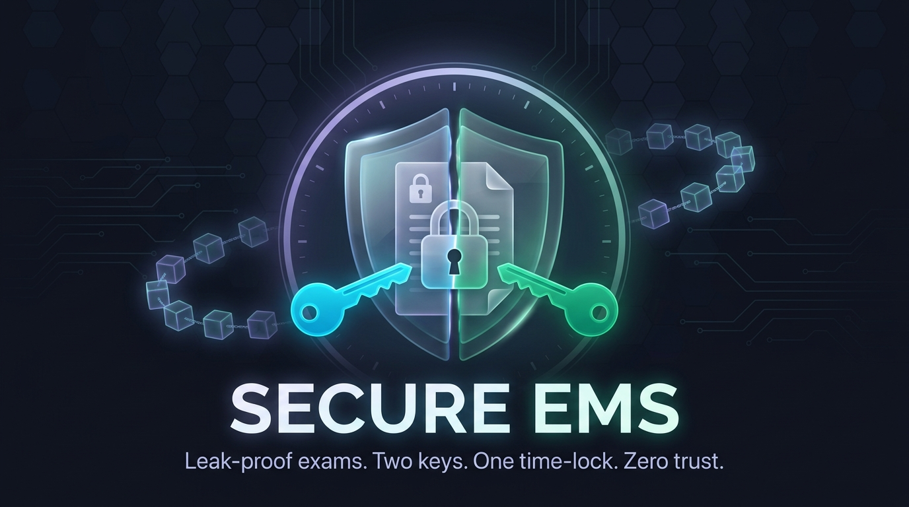

<div align="center">



# 🛡️ Secure EMS (Examination Management System)

**Next-Generation Examination Platform with Post-Quantum Security & Immutable Blockchain Auditing.**

[](https://github.com)
[](https://fastapi.tiangolo.com)
[](https://reactjs.org/)
[](https://postgresql.org)
[](https://electronjs.org/)
[](https://opensource.org/licenses/MIT)

*An end-to-end robust, tamper-proof, and highly secure examination distribution framework.*

</div>

---

## 🌟 Vision & Overview

**Secure EMS** is designed to eliminate exam leaks, ensure absolute integrity in question paper distribution, and provide irrefutable cryptographic audit trails. By leveraging modern cryptographic primitives (including future-ready PQC hybrid key wrappers), decentralized ledger technology (blockchain anchoring), and strict zero-knowledge proofs (ZKP) for center authentication, we are redefining how high-stakes examinations are conducted worldwide.

Whether deploying locally via our optimized Electron desktop kiosk or managing nationwide distribution through the cloud dashboard, Secure EMS guarantees absolute transparency without compromising on data secrecy.

---

## 🔥 Key Features

*   **🌐 Immutable Blockchain Ledgers**: Every critical action—from supervisor authentication to question paper unlocking—is hashed and anchored onto a smart contract. An embedded hash-chain `audit_logs` verifier ensures the cryptographic sequence has never been tampered with.
*   **🔒 Post-Quantum Cryptography (PQC)**: Prepared for the future with `ML-KEM-1024-KYBER-HYBRID` key wrappers and dual-key envelope encryption. Question papers stay completely locked until the scheduled unlock time.
*   **🧠 Zero-Knowledge Proof (ZKP) Authentication**: Kiosk supervisors must authenticate using challenge-response protocols ensuring their credentials are never transmitted in plain text.
*   **🛡️ Multi-Tier Architecture**:
    *   **Cloud Backend**: A blazingly fast FastAPI backend connected to Supabase PostgreSQL, dynamically mapping queries and enforcing robust rate limits.
    *   **Desktop Kiosk**: An Electron + React frontend that bundles the backend natively for completely isolated testing center environments.
*   **🧹 Secure RAM Zeroization**: Decrypted question papers exist only in volatile memory and are explicitly scrubbed and zeroized upon completion, leaving zero forensic trace on disks.
*   **📊 Live Dashboard**: Real-time personnel status, center monitoring, and instant auditing of cryptographic ledger validity.

---

## 🏗️ System Architecture

Our tech stack is tailored for maximum performance, maintainability, and security:

### **Backend (`/backend`)**
*   **Framework**: FastAPI (Python)
*   **Database**: PostgreSQL via Supabase (Legacy SQLite abstraction via `cloud_db_driver` ensures maximum compatibility and smooth transitions).
*   **Web3/Blockchain**: PyCryptodome & Ethers.js conceptually bridged for secure smart contract interactions (`secure_blockchain_engine.py`).
*   **Testing**: Fully covered by `pytest` ensuring 100% CI/CD pipeline reliability.

### **Frontend (`/frontend`)**
*   **Core**: React + Vite for rapid development and optimized bundle sizes.
*   **Desktop Shell**: Electron builds orchestrated via `electron-builder` using `main.cjs` integration.
*   **UI/UX**: Custom CSS mimicking dynamic, modern glassmorphic designs.

---

## 🚀 Getting Started

### Prerequisites
*   **Node.js** (v18+)
*   **Python** (3.12+)
*   **Supabase / PostgreSQL** (For cloud deployments)

### 1️⃣ Setting up the Backend
```bash
cd backend
python -m venv .venv
source .venv/bin/activate  # On Windows use: .venv\Scripts\activate
pip install -r requirements.txt

# Copy environment variables and fill your details
cp .env.example .env

# Run tests to ensure everything is perfect
python -m pytest

# Start the local API server
uvicorn server:app --reload --port 8000
```

### 2️⃣ Setting up the Frontend
```bash
cd frontend
npm install

# Start the Vite dev server
npm run dev
```

### 3️⃣ Building the Desktop App (Electron)
```bash
cd frontend
# Build Vite optimized assets
npm run build
# Package into a native executable for your OS
npm run build:electron
```

---

## 🧪 Testing & CI/CD Pipeline

The project implements rigid automated testing via **pytest**. The pipeline will fail if any cryptographic audit logs show signs of tampering or if the time-lock window rules are violated. 

*To manually verify ledger integrity:*
```bash
curl -X GET http://localhost:8000/api/audit-logs/verify-integrity
```
*Expected Output:*
```json
{
  "status": "VERIFIED",
  "audit_chain_valid": true,
  "message": "Cryptographic audit ledger hash chain verified intact. Zero tampering detected."
}
```

---

## 🔐 Security Disclosures & Best Practices
*   **Environment Variables**: Never commit `.env` files. We strictly enforce this via `.gitignore`. An `.env.example` template is provided.
*   **Data Loss Prevention**: All schema drops or truncations have been strictly abstracted away. Modifying `audit_logs` breaks the `previous_hash` > `current_hash` chain intentionally to alert administrators.

---

## 📄 License
This project is licensed under the **MIT License**. See the [LICENSE](LICENSE) file for more information.

<div align="center">
  <br>
  <i>Built with ❤️ by the open-source community. If you like what we're doing, drop us a ⭐!</i>
</div>
